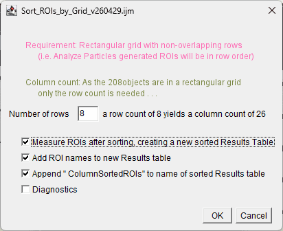

# asc-ImageJ-ROI_Utilities

<h2>A collection of ROI utilities for ImageJ/Fiji</h2>

These are
<a href="https://imagej.net/">ImageJ</a> /
<a href="https://fiji.sc/">Fiji</a>
macros that do some useful things with ROIs:

<h3 id = "CreateROIGrid">Create_grid_of_ROIs_from_single_selection</h3>

Creates a square grid of ROIs that are identical to the current selection. 
Original purpose was to create ROIs for scanned 35&nbsp;mm film strips.

<h3 id = "CreateUniformOverlaysFromROIs">Create_same_style_Overlays_for_each_ROI</h3>

Forces all overlays to have the same style.

<h3 id = "CreateTransparentOverlayFromROI">Create_Transparent_Overlay_for_Selected_ROI</h3>

Creates a transparent overlay from the selected ROI.

<h3 id = "ExportAllROIsAsImageFiles">Export_all_ROIs_as_ImageFiles</h3>

Exports all ROIs as individual image files. An expanded region our the ROIs can also be included for context and the region size can be set to the same values for all ROIs-clips. The menu below shows the current options.

<h3 id = "ExportROIsInSelectedArea">Export_ROIs_in_Selected_Area</h3>

Exports a collection of ROIs based on the selected area.

<h3 id = "SetROIColorandTransparency">ROI_set_Color_and_Transparency</h3>

Opens up a dialog similar to the built-in ROI properties dialog but adding drop-downs for fill and stroke color selection and sliders for transparency.

	

<h3 id = "SortROIsByProximity">Sort_ROI_set_by_Proximity_to_Current_ROI_set</h3>

Sorts an archived ROI set by proximity to the current ROI set.

<h3 id = "SortROIsToGrid">Sort ROIs to a Rectangular Grid</h3>

The original order of objects (and ROIs) is by a top-to-bottom, left-to-right scan and if you have x,y grid of analysis points this may not exactly match the intuitive column/row order you would expect. You can use this macro to sort the ROIs of a rectangular grid into column-by-column, row-by-row order. This is particularly useful when combining with the export ROIs as image files macro above so that montaging the ROIs back into the same grid pattern respects the original arrangement. This macro was created to handle grids of microhardness indents.

<em>Requirement</em>: The rows must not overlap with each other and ROIs are already in the top-left:bottom-right order that would be expected from <em>Analyze Particles</em>.

<ul>
  <li>Sorts ROIs</li>
  <li>Adds row and column numbers to ROI name</li>
  <li>Appends original ROI name to final ROI name for reference</li>
  <li>Option to add ROI names to re-measured Results Table</li>
  
</ul>

<strong><subLegal Notice:</strong>

These macros have been developed to demonstrate the power of the ImageJ macro language
and we assume no responsibility whatsoever for their use by other parties, and make no
guarantees, expressed or implied, about their quality, reliability, or any other
characteristic. On the other hand, we hope you do have fun with them without causing harm.

The macros are continually being tweaked and new features and options are frequently
added, meaning that not all of these are fully tested. Please contact me if you have any
problems, questions, or requests for new modifications.</sub

</body>
</html>